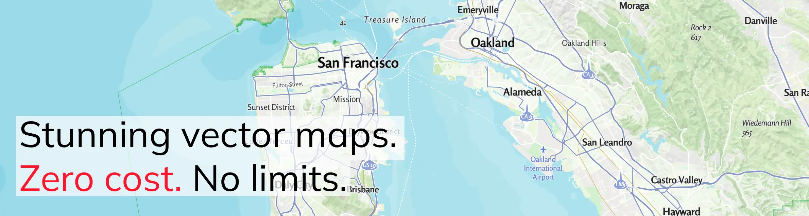
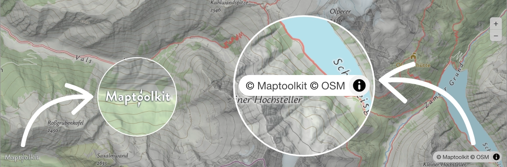

# Maptoolkit Community License

Free, production-grade vector basemaps for the open web. Powered by OpenStreetMap and MapLibre under the [Maptoolkit Community License](https://maptoolkit.org/).

### ⚡ **No API key. No sign-up. No request limits.** ⚡ 
Drop a style URL into MapLibre and ship. That's the whole onboarding.

---

## Quick Start

```html
<link rel="stylesheet" href="https://unpkg.com/maplibre-gl/dist/maplibre-gl.css" />
<script src="https://unpkg.com/maplibre-gl/dist/maplibre-gl.js"></script>

<div id="map" style="width:100%;height:480px"></div>

<script>
  const map = new maplibregl.Map({
    container: 'map',
    style: 'https://styles.maptoolkit.net/summer.json',
    center: [11.4, 47.27],
    zoom: 8,
  });
</script>
```

1. Include MapLibre GL JS (CSS + script).
2. Add a container element.
3. Point `style` at a Maptoolkit style URL — e.g. `maptoolkit`, `light`, `hiking`, `winter`, `dark`, `street_city`.
4. Make sure the **Maptoolkit + OpenStreetMap** attribution stays visible — it's required by the [Community License](https://maptoolkit.org/).
5. Ship.

For style options and license terms see [maptoolkit.org](https://maptoolkit.org/).

---

## Limitations

The Community License is intentionally scoped to public-facing front-end use. The following capabilities are **not** part of the free service and are only available under the [Maptoolkit Enterprise License](https://www.maptoolkit.com):

**Usage**
- No use behind authentication (no use for internal tools, behind paywalls, in intranets)

**Service**
- No SLA - community service is best-effort
- No dedicated support and dedicated project manager, community support only 
- No direct developer access

**No access to APIs beyond vector tiles**
- [Raster Tiles API](https://www.maptoolkit.com/api/raster-tiles-api/)
- [Static Maps API](https://www.maptoolkit.com/api/static-maps-api/)
- [Printmaps API](https://www.maptoolkit.com/api/printmaps-api/)
- [Routing API](https://www.maptoolkit.com/api/routing-api/)
- [Map Matching API](https://www.maptoolkit.com/api/map-matching-api/)
- [Isochrone API](https://www.maptoolkit.com/api/isochrone-api/)
- [Data Enhancement APIs](https://www.maptoolkit.com/api/data-enhancement-tools/)
- [Elevation API](https://www.maptoolkit.com/api/elevation-api/)
- [Weather API](https://www.maptoolkit.com/api/weather-api/)
- [Geocoding API](https://www.maptoolkit.com/api/geocoding-api/)

If your project needs any of the above — or your organisation grows beyond **EUR 1M annual revenue / 10 FTE** — [talk to us about Enterprise](https://www.maptoolkit.com).

---

## Attribution Guidelines

Every map served under the Community License **must** visibly attribute both **Maptoolkit** and **OpenStreetMap** — at all times, on every map, no exceptions.



**Requirements:**

- **Maptoolkit logo** — displayed clearly on the map, minimum **24px** height (24pt/dp on mobile, including Retina).
- **Copyright line** — `© Maptoolkit © OSM` in the bottom-right corner; both names must be clickable links to [maptoolkit.com/copyright](https://www.maptoolkit.com/copyright/) and [openstreetmap.org/copyright](https://www.openstreetmap.org/copyright) respectively.
- **Legibility** — logo and copyright must remain fully visible and unobstructed at every map size, orientation and zoom level.
- **Z-index** — custom UI controls or overlays must not hide or obscure the attribution.

Drop-in plugins handle this for you:

- MapLibre: [`@maptoolkit/maplibre-gl-logo`](https://www.npmjs.com/package/@maptoolkit/maplibre-gl-logo)
- Leaflet: [`@maptoolkit/leaflet-logo`](https://www.npmjs.com/package/@maptoolkit/leaflet-logo)

---

## FAQ

### Why is this service free?

Maptoolkit was built on top of two communities — the open data of [OpenStreetMap](https://www.openstreetmap.org/) and the open-source ecosystem around [MapLibre](https://maplibre.org/). Without them, the product wouldn't exist. The Community License is our way of giving something back: the same production-grade vector tiles that power our commercial customers, made available for free to small teams, hobbyists, non-profits, educators and the open-source community. Maptoolkit funds the infrastructure; the commercial Enterprise tier subsidises the free one.

### Do I really not need an API key, and what about rate limits?

No key, no sign-up. Adaptive rate limiting protects shared infrastructure: unregistered traffic gets **10 req/s sustained** and **50 req/s burst** (uncached requests only — 95%+ of traffic is cached at the edge). If you need more headroom, you will soon be able to register your domain or app User Agent on [maptoolkit.org](https://maptoolkit.org/) to raise the ceiling to **100 / 500 req/s**. Still no key to manage.

### Can I use this in a commercial product?

Yes — if your organisation is under both **EUR 1M annual consolidated revenue** *and* **10 FTE employees**. You must keep the Maptoolkit + OpenStreetMap attribution visible. Backend-only processing, bulk extraction, offline tile generation, mirroring, reselling and use in print are not permitted under the Community License — those need Enterprise (or, for printable maps, [Printmaps.net](https://www.printmaps.net/)).

---

## 💬 Need help? Have a question?

**👉 [Go to GitHub Discussions](https://github.com/maptoolkit/maptoolkit.org/discussions)**

[](https://github.com/maptoolkit/maptoolkit.org/discussions)

Discussions is the place for **questions, ideas, showcases and general support**.
Please **don't open an Issue** for support requests — Issues are reserved for verified code bugs. See [SUPPORT.md](SUPPORT.md) for details.

By participating in this project you agree to abide by our [Code of Conduct](CODE_OF_CONDUCT.md).
